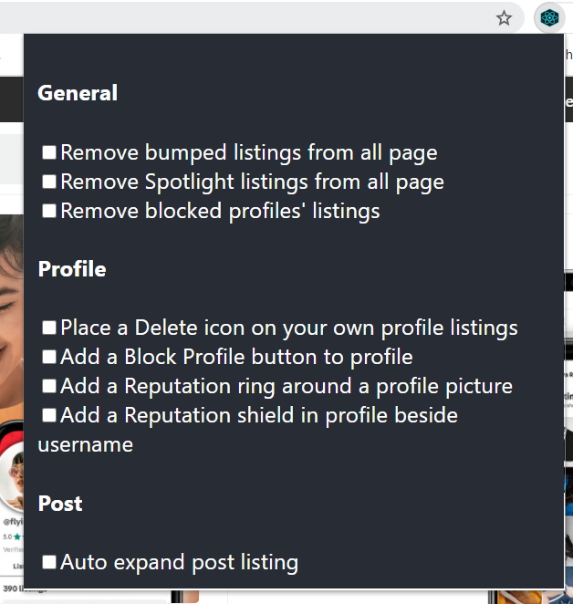
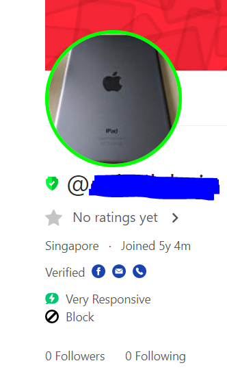

# EnhancedCarousell

The main focus of this project is to **learn** both Chrome Extension and to **improve** React.

## Todo list

-   Allow item blacklist
    -   Create another button below the listing "like" button
-   Allow account reputation
    -   Server required (can look into Firebase)
-   Allow removal of sponsored items
    -   Set as an option to prevent breaking their terms and condition
-   Allow fast access to multiple account
    -   Can be as another tab